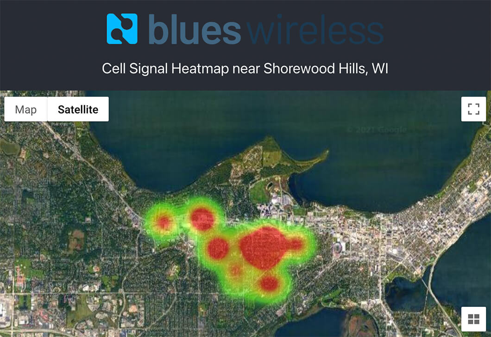

# Create a Cellular Signal Heatmap with Raspberry Pi Pico and GPS

In this web + cloud + IoT project, I use a cellular + GPS device (Notecard) and
a Raspberry Pi Pico to create a gorgeous heatmap of cell signal data in my city.

> Watch an [intro video](https://youtu.be/aFaDIDqyjCE) and then view the
> complete tutorial over at [Hackster.io](NEED LINK)!

**Hardware:**

- [Raspberry Pi Pico](https://www.raspberrypi.org/products/raspberry-pi-pico/)
- [Notecard and Notecarrier-A](https://blues.io/products/) from Blues Wireless
- [1602A LCD Module](https://www.sunfounder.com/products/i2c-lcd1602-module)
- [Breadboard Power Supply Module](https://smile.amazon.com/gp/product/B08JYPMCZY/ref=ppx_yo_dt_b_asin_title_o00_s00?ie=UTF8&psc=1)

**Software and Services:**

- [Python](https://www.python.org/)
- [Blues Wireless Notehub](https://blues.io/services/)
- [Google Cloud Platform](https://cloud.google.com/) (Cloud Firestore, Cloud
  Functions, and Google Maps)
